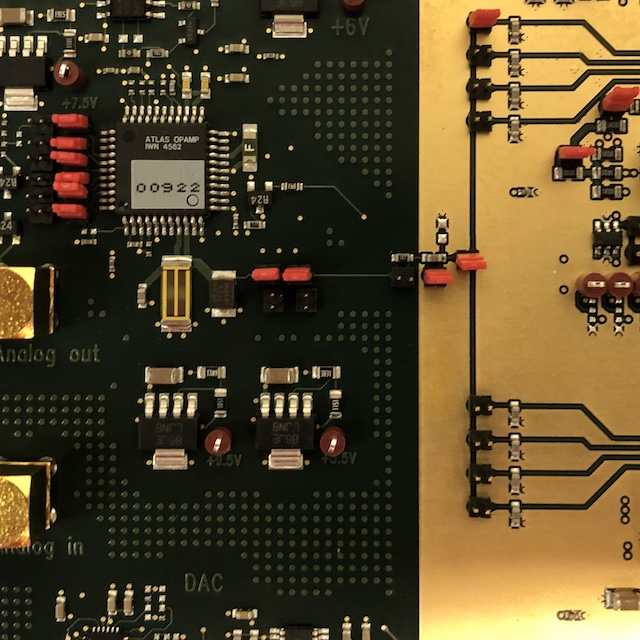
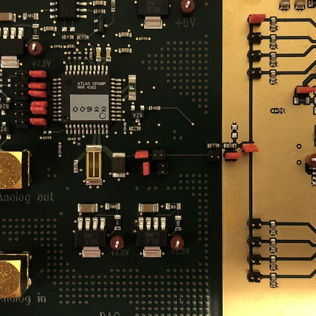
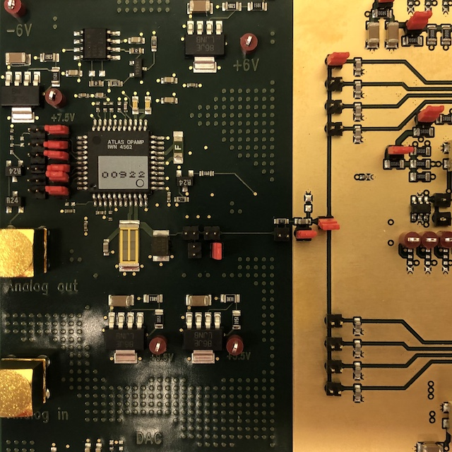
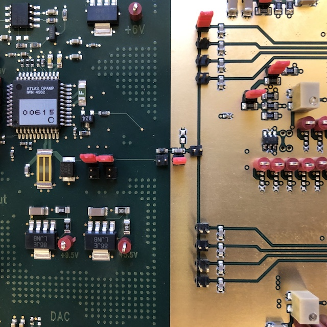
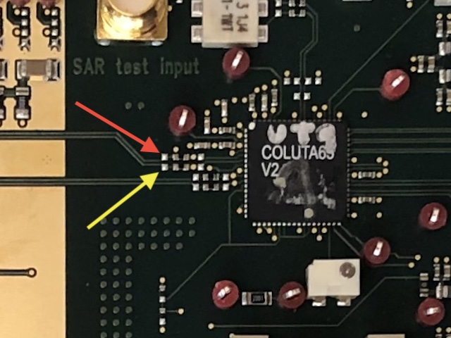

Testboard Setup
===============
1. Plug the 5 power cables in to a power supply with the following settings:

 
|      Cable      | Voltage | Current Limit |
|:---------------:|:-------:|:-------------:|
| Red, lower left |  +3.8 V |      5 A      |
| Red, upper left | +10.5 V |      1 A      |
|      Blue       |   -7 V  |      1 A      |
|   Both black    |  Ground |               |
    
   The correct _input_ voltage are printed on the board

2. Connect a 640 MHz, 500 mV (0 to peak) clock signal to "640MHz clock" input on right side of board
3. Connect optical cable to both optical ports 
4. Connect USB cable to input next to FPGA on the bottom side of the board
5. Ensure the jumpers left of the LAUROC chips are as shown: 



For normal operation with the onboard pulser, the above steps are sufficient. 
However, it is possible to connect the testboard to an external function generator 
and an oscilloscope. 

Connecting External Instruments
-------------------------------
On the left side of the board there are two SMA connectors labeled 
"Analog out" and "Analog in". 

By moving the jumpers to the configuration shown below and connecting the "Analog out" 
connector to an oscilloscope the user can view the pulse generated by the onboard pulser. 



By moving the jumpers to the configuration shown below and connecting the "Analog in" 
connector to an external function generator, the user can send an arbitrary pulse 
into the LAUROC pre-amp/shaper ASICs. 



Triggering External Instruments
-------------------------------
To help with using external instrumentation, there are two "Trigger out" connectors on 
the bottom of the board, to the right of the optical port. Any time a trigger is sent to 
the onboard pulser, a trigger is also sent out of these two connectors. The right 
connector sends out a positive-going trigger, and the left a negative-going. 

SAR Test Input
--------------
It it possible to bypass the LAUROC and the DRE in the COLUTA by connecting an external 
function generator to the connector labeled "SAR test input" near the top side of the board. 
There is not a physical jumper to change in order to get this working, but in the GUI
the user must deselect "DRE to SAR" and select "External to SAR" on the COLUTA1 Channel 1 tab. 

Pedestal Run
------------
In order to take a set of pedestal data, the analog readout chain must be disconnected 
from the pulse delivery portion of the board. This can be done by moving the jumpers to 
the configuration shown below



Adjusting Potentiometers
------------------------
The testboard has 20 potentiometers that regulate reference voltages to the various chips.
They should be set to the correct voltages already, but it is possible that they drift over
time or change during transit. Below is a table of the potentiometers and the voltages to 
which they should be set relative to ground, referring to their number labels as listed 
in the schematic files on the TWiki page.

| Pot # |  Volts  |     | Pot # |    Volts   |
|:-----:|:-------:|:---:|:-----:|:----------:|
|   1   |   1.3   |     |   11  |     1.7    |
|   2   |   1.0   |     |   12  |     0.6    |
|   3   |   1.0   |     |   13  |     0.6    |
|   4   |   1.0   |     |   14  |     0.6    |
|   5   |   1.3   |     |   15  |     1.1    |
|   6   |   1.0   |     |   16  |     0.1    |
|   7   |   1.2   |     |   17  |  See Below |
|   8   |   0.6   |     |   18  |  See Below |
|   9   |   1.0   |     |   19  |     0.6    |
|  10   |   0.2   |     |   29  |     1.2    |

Potentiometer 17 and 18 need to be set based on the baseline voltage going into the COLUTA
channels, which can be measured at the two solder points specified below. P17 and P18 
should then be set according to the following formula:
```
Voltage at red arrow + Voltage from P18 = 1.2 V
Voltage at yellow arrow + Voltage from P17 = 1.2 V
```

